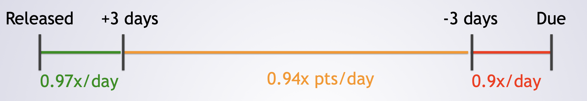

# ECE 651 - Homework 2 - Spring 2024 - Battleship
This assignment is graded over 100 points and it is worth 10 points in the final grade.

## Submission
- Your submission is completed by **commit** and **push** to the **GitHub Repository** you were provided by classroom. 
- You will need to generate a release of your code once you are done a specific required point. 
- Your code **must** compile and work on the **VM** environment as described by the [development guide](https://adhilton.pratt.duke.edu/651-development-setup).
    - So, if you are not using the VM, before marking the release, clone your repository on the vm, and compile and run your program there to ensure it works fine in such environment.

>[!CAUTION]
>- **The assignment is due 11:59 PM Wednesday Feb 21.**
>    - Though intermediate deliverables are required for extra credit (see below).

## Late Work Policy

- As described on day one, you can request additional days. Depending when you request those, is how large the penalty will be. 
- E.g.,
    - Late days requested within 3 days of assignment release
        - 0.97x multiplier per day requested
    - Late days requested on day 4 or later, but before (due date - 3)
        - 0.94x multiplier per day requested
    - Late days requested within 3 days of due date
        - 0.9x multiplier day requested
## Extra Credit
- There is a one final extra credit due later on. 
- If you meet the suggested completion dates for Goals 1-5 of version 1 (more details on overview):
    -  5 Goals met: +30 points                                                   
    -  4 Goals met: +20 points                                                   
    -  3 Goals met: +15 points                                                 
    -  2 Goals met: +10 point                                                    
    -  1 Goal met:  +5 points

## Description
For this assignment, you are going to write a text-based version of the game "battleship".
If you are not familiar with the game, you can read about it in [Wikipedia](https://en.wikipedia.org/wiki/Battleship_(game)) before you get started.  
Of course, no matter how familiar you are withthe game, please read our description, as we are going to make it slightly different from normal.

Before we dive into the battleship game you need to write, let us take a moment to discuss the structure and goals of this assignment:
  (1) To help you think about task breakdown, scheduling,  and planning.
  (2) Deepen your exposure to Java
  (3) To help you see incremental development and testing in action
  (4) To let you see design ideas in practice
  (5) To see how these design ideas work with respect to changing requirements.

To acheive these goals, we have set this assignment up with three parts:

- **Version 1**: done as a walkthrough.
    - Note that extra credit is available on Version 1 for completing intermediate deliverables by specific dates.
- **Version 2**: done on your own, and
- **Extra Credit**: optional.

We layout the requirements for all of these parts in the [problem statement](./problem_statement.md).
We encourage you to read the entire document FIRST.  
Note that in the real world, when requirements are going to change, you do not get to see "version 2" before you finish version 1.  However, you do here for the way the learning is structured.

We are going to then walk you through Version 1.  
At the start, we are going to be very prescriptive: telling you exactly what to do and how to do it.  
As we go through Version 1, we will provide less and less detail with each step. 
 When you finish Version 1, you will be ready to start on Version 2, which you will do completely on your own.

### Here is what you should do:
- (1) Read this README and Problem Statement completely
- (2) Spend 20 minutes thinking about what classes you would make and how well they meet the design principles we have discussed.
    -  This activity is described in more detail at the end of the [problem statement document](./problem_statement.md) ("Next Steps" section).
- (3) Read and do the walkthrough.  Note that this walkthrough will take a while as it comprises over half of the work in this homework  assignment. We expect this step to be spread out over a mater of weeks.
- (4) Git push your completed version 1 (after testing etc)
    - You will also need to push frequently and generate `releases` for extra credit.
- (5) Do version 2
- (6) Submit version 2 by `git push` and then tag the release. 

***

>[!NOTE]
> - You can now proceed to [problem statement document](./problem_statement.md)