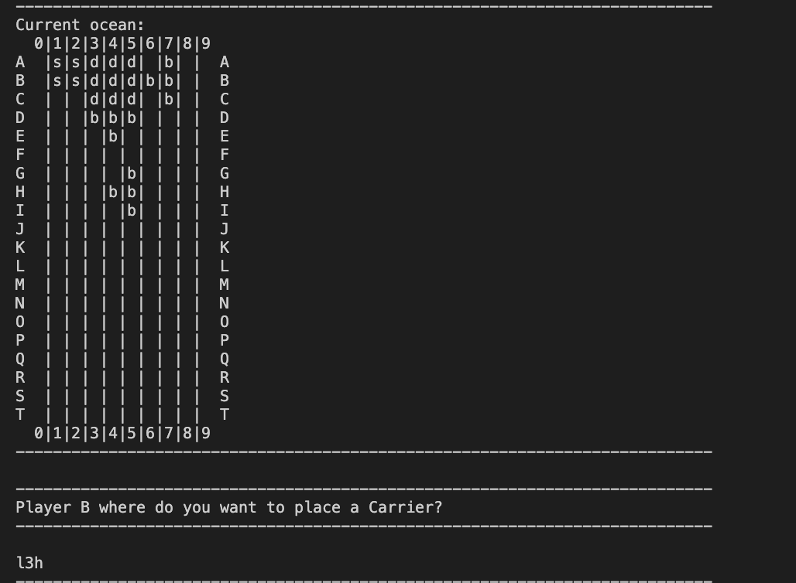
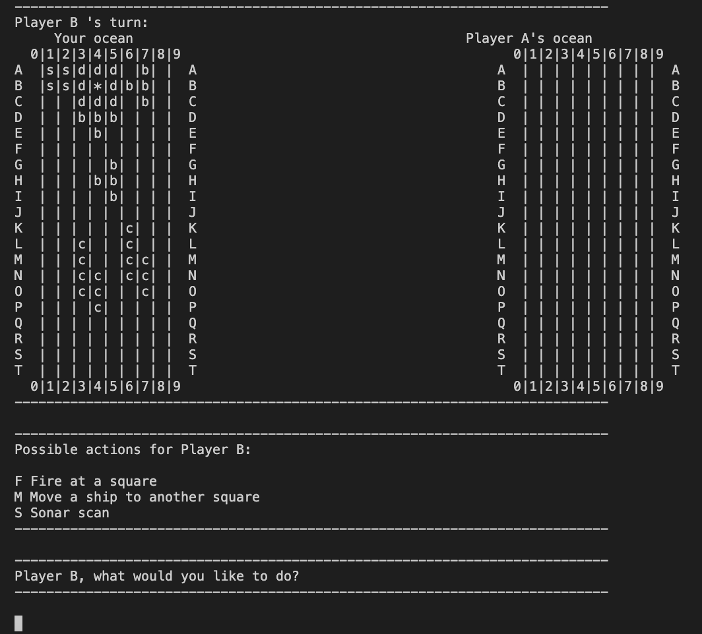
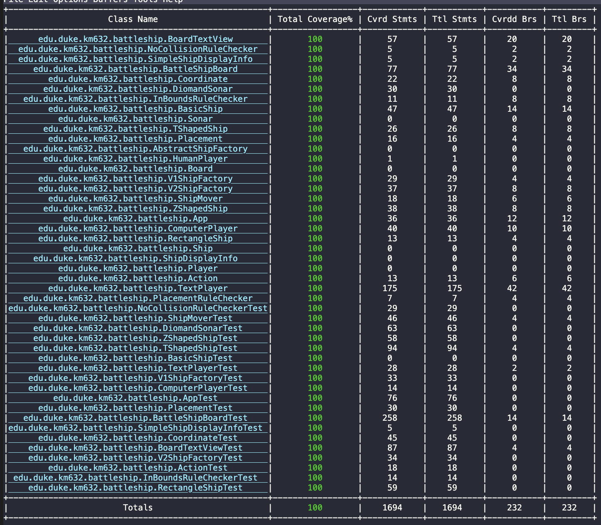

# Battleship Game

## Overview 
This is a console-based battleship game! Given a 10x20 board, each player must place 10 ships before starting the game. To win the game, a player must sink all of opponents ships.
There are two versions of the game built. The first version only allows opponents to fire each other's boards. The second version has two more functionalities that are described below. 

1. A player can move their ship position anytime during the game even if the ship is partially/fully sunk! This feature is there to keep the opponent confused!
2. A player can scan the opponent's board around a specific point. This allows the player to gain more insights into the opponent's ship positions.

**Tech used:** Java, Gradle, JUnit for unit testing, Clover for test coverage

## How to Build/Run

1. run ./gradlew  installDist 
2. run ./app/build/install/app/bin/app

## Screenshots showing example play

### A player is asked to place a ship: 

### A player is asked to choose between 3 options: 

A player is shown not only his board but also their opponent's board! If the player successfully hits the opponent's ship, "*" will be shown on the board on the right. 

## Testing 

JUnit and Clover have been used! 100% test coverage is achieved! 

## Contributions

This project was done based on the software engineering course assignment requirements which can be found in problem_statment.md. 
Version 1 was completed carefully following the step-by-step walkthrough. This exercise helped sharpen my OOP design skills. 
Version 2 was independently designed and implemented by Haliunaa Munkhuu, me :) 

